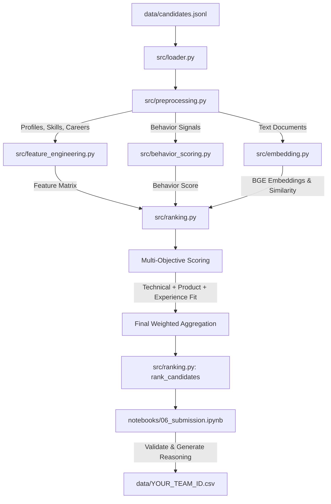

# 👔 Redrob Ranker - Intelligent Candidate Discovery & Ranking Engine

[](https://www.python.org/)
[](https://redrob.com/)
[](https://huggingface.co/sentence-transformers)

An advanced talent matching and ranking system engineered to parse, analyze, evaluate, and rank candidate profiles against highly complex job descriptions (JDs). Built specifically for the **Redrob Hackathon: Intelligent Candidate Discovery & Ranking Challenge**, this system implements a multi-objective scoring pipeline that moves beyond simple keyword matching to capture semantic relevance, career growth, stability, and real-time behavioral signals.

---

## 📐 Pipeline Architecture

The system processes large-scale candidate profiles through a multi-stage modular pipeline, culminating in a weighted multi-objective ranker:



---

## 🎯 The Redrob Recruitment Logic (Anti-Trap Strategy)

Traditional Applicant Tracking Systems (ATS) fail by performing naive keyword counts. The Redrob Ranker is architected to avoid these common pitfalls by incorporating industry-specific hiring heuristics:

*   **🚫 The Keyword Trap:** Candidate profiles stuffed with artificial AI keywords are scrutinized. The engine values *actual career history details* and *verifiable hands-on roles* over plain list of skills.
*   **🏢 Product vs. Service Company Weighting:** Early-stage startups need builders. The engine calculates a custom ratio based on product companies (e.g., *Meta, Google, Swiggy, freshworks, Razorpay*) and applies penalties for candidates whose career is entirely in large consulting/service companies (e.g., *Infosys, TCS, Wipro, Accenture*) if they lack product-company exposure.
*   **⏳ Availability & Behavioral Drift:** A stellar candidate who is unresponsive or has not logged in is a hiring liability. The engine uses Redrob signals (recruiter response rate, notice period, active logins) to discount unreachable talent.
*   **📈 Experience Fit Curve:** Evaluates experience against the JD's sweet spot. For the founding Senior AI Engineer role, a custom normal-like curve maximizes scores for 6–8 years of experience, smoothly down-weighting below 5 or above 9 years.

---

## 📂 Project Structure

```directory
Redrobe-Ranker/
├── data/
│   ├── job_description.md         # The target job description (e.g., Senior AI Engineer)
│   ├── candidates.jsonl           # [HEAVY] Raw candidate profile logs (487MB - Git Ignored)
│   ├── sample_candidates.json     # Sandbox dataset for rapid algorithm prototyping
│   ├── features.parquet           # Cache of engineered candidate features
│   ├── semantic_scores.parquet    # Cache of BGE-small semantic similarity calculations
│   ├── behavior_scores.parquet    # Cache of calculated availability & engagement scores
│   └── YOUR_TEAM_ID.csv           # Final validated submission CSV file
├── src/
│   ├── loader.py                  # Stream reader for large JSONL datasets
│   ├── preprocessing.py           # DataFrame builder for profiles, careers, skills, and signals
│   ├── feature_engineering.py     # Aggregates stability, python/embedding/DB skills, and quality scores
│   ├── embedding.py               # Document builder and SentenceTransformer cosine sim model (BGE)
│   ├── behavior_scoring.py        # availability, recruiter interest, trust, and engagement sub-scorers
│   └── ranking.py                 # Core fit scorers, final weighted calculation, and ranking functions
├── notebooks/
│   ├── 01_data_exploration.ipynb  # Initial EDA and data distribution analysis
│   ├── 02_feature_engineering.ipynb# Prototyping career stability and tech-stack keywords
│   ├── 03_embedding_detection.ipynb# Sentence transformer semantic search tests
│   ├── 04_behavior_and_availability_scoring.ipynb # Normalization of interaction metrics
│   ├── 05_ranking_engine.ipynb    # Combining features and semantic vectors into a ranker
│   └── 06_submission.ipynb       # Runs end-to-end pipeline, compiles reasoning text, and outputs CSV
├── .gitignore                     # Comprehensive git ignore configuration for heavy files
├── requirements.txt               # Dependencies with data source specifications
└── README.md                      # This comprehensive documentation file
```

---

## 🛠️ Modules Breakdown & Core Logic

### 1. Data Loader & Preprocessor (`src/loader.py`, `src/preprocessing.py`)
Reads the heavy `candidates.jsonl` dataset line-by-line using a generator to conserve memory. It parses the nested structures into four highly optimized relational Pandas DataFrames:
*   `profiles`: Base attributes (years of experience, headline, current title).
*   `skills`: List of skills, proficiency tags, duration, and endorsement counts.
*   `career`: Full employment history (company, job title, duration, descriptions).
*   `signals`: Redrob behavioral activity (profile completeness, recruiter response rate, notice period, Github activity, interview completion).

### 2. Semantic Search Engine (`src/embedding.py`)
Constructs a descriptive text document for each candidate:
```text
Headline: [headline]
Summary: [summary]
Current Title: [current_title]
Years of Experience: [years_of_experience]
Skills: [comma-separated skills list]
Career History: [space-separated job descriptions]
```
The model encodes this document alongside the target job description using HuggingFace's `BAAI/bge-small-en-v1.5` sentence transformer. Features automated checkpointing (saving batch scores to a Parquet file) to resume execution in case of interruptions.

### 3. Behavioral Scorer (`src/behavior_scoring.py`)
Computes four sub-components and aggregates them into a final **Behavior Score** (scaled 0 to 1):
*   **Availability (35%):** Weighs `open_to_work_flag` (35%), `recruiter_response_rate` (30%), response time (20%), and short notice period (15%).
*   **Recruiter Interest (15%):** Profiles views, search appearances, bookmarks, endorsements, and connection counts.
*   **Trust (20%):** Validated email (20%), validated phone (20%), linked accounts (20%), and profile completeness (40%).
*   **Engagement (25%):** Interview completion rate (35%), offer acceptance rate (30%), GitHub activity score (20%), and completed skill assessments (15%).

$$\text{Behavior Score} = 0.40 \cdot \text{Availability} + 0.15 \cdot \text{Recruiter Interest} + 0.20 \cdot \text{Trust} + 0.25 \cdot \text{Engagement}$$

### 4. Ranking Engine & Weighted Synthesis (`src/ranking.py`)
Computes compound indicators:
*   **Technical Score:** High weights on Python proficiency, embedding expertise, vector database skills, and production deployments.
*   **Product Fit Score:** Current title keywords match + product company ratio, minus a penalty for pure service/outsourcing experience.
*   **Experience Fit Score:** Tailored scoring function based on distance from the target experience band:
    *   $6 - 8$ Years $\rightarrow 1.0$
    *   $5 - 9$ Years $\rightarrow 0.9$
    *   $4 - 10$ Years $\rightarrow 0.7$
    *   Others $\rightarrow 0.3$

#### Final Scoring Formula:
$$\text{Final Score} = 0.35 \cdot \text{Semantic Similarity} + 0.30 \cdot \text{Technical Score} + 0.15 \cdot \text{Behavior Score} + 0.10 \cdot \text{Product Fit} + 0.10 \cdot \text{Experience Fit}$$

---

## 🚀 Setup & Execution Guide

### 📋 Prerequisites
Ensure you have Python 3.10+ installed.

### 1. Clone & Set Up Virtual Environment
```bash
# Clone the repository
git clone https://github.com/vish-34/Redrobe-Ranker.git
cd Redrobe-Ranker

# Create a virtual environment
python -m venv .venv

# Activate virtual environment
# On Windows (PowerShell):
.venv\Scripts\Activate.ps1
# On macOS/Linux:
source .venv/bin/activate
```

### 2. Install Dependencies
```bash
pip install -r requirements.txt
```

### 3. Place Required Data Files
As described in [requirements.txt](file:///c:/Users/vishal/Desktop/Redrobe-Ranker/requirements.txt), place your data files inside the `data/` directory:
- `data/candidates.jsonl` (487MB dataset containing candidates records)
- `data/job_description.md` (target job description document)
- *(Optional)* Place precalculated `semantic_scores.parquet` and `behavior_scores.parquet` in the directory to bypass long model inference steps.

### 4. Execute the Pipeline
You can run the full ranking generation, reasoning builder, validation checks, and submission export using Jupyter Notebook:

```bash
jupyter notebook notebooks/06_submission.ipynb
```
*Run all cells to compute scores and save the output.*

---

## 📝 Dynamically Generated Reasoning Example
For transparency, the submission output contains a natural-language description (`reasoning` column) for the top-100 ranked candidates. For example:
> *"7.8 years as Senior NLP Engineer. Excellent semantic match to the AI Engineer job description. Demonstrates retrieval or ranking experience. Has embeddings experience. Worked with vector databases. Strong product-company background. High recruiter engagement and availability."*

---

## 🔒 Security & Git Protection
To comply with hackathon rules and prevent pushing large files to GitHub, `.gitignore` has been pre-configured to block:
- Large JSONL logs (`candidates.jsonl`)
- Raw pre-computed tables (`*.parquet`)
- Output submission logs (`YOUR_TEAM_ID.csv`)
- Python environment files, caches, and IDE configs (`.venv/`, `__pycache__/`, `.ipynb_checkpoints/`, `.vscode/`)

---

## 🏆 Submission Validation Checklists
The submission notebook automatically runs assertions to guarantee standard compliance before saving:
1.  **Count Constraint:** Exporter extracts exactly the top **100** candidates.
2.  **Uniqueness:** Guarantees **100** unique candidate IDs.
3.  **Strict Monotonicity:** Verifies candidate list is strictly sorted by score in descending order.
4.  **No Nulls:** Assures all reasoning, rank, and score columns are non-empty.
